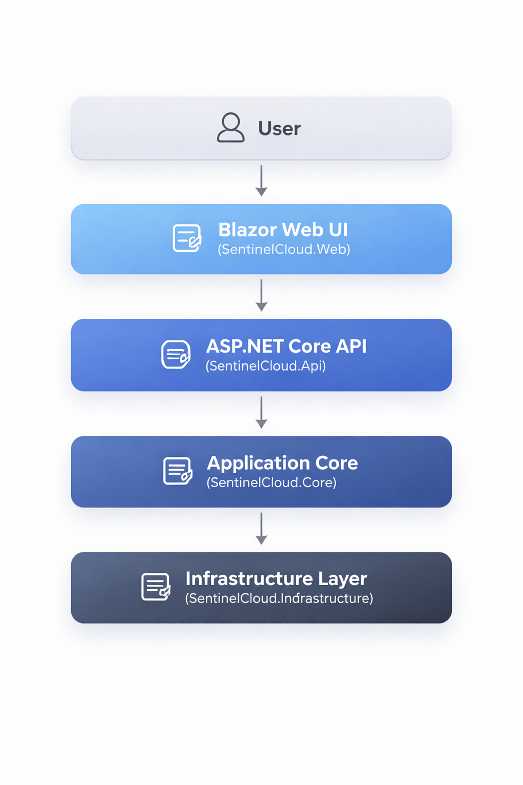
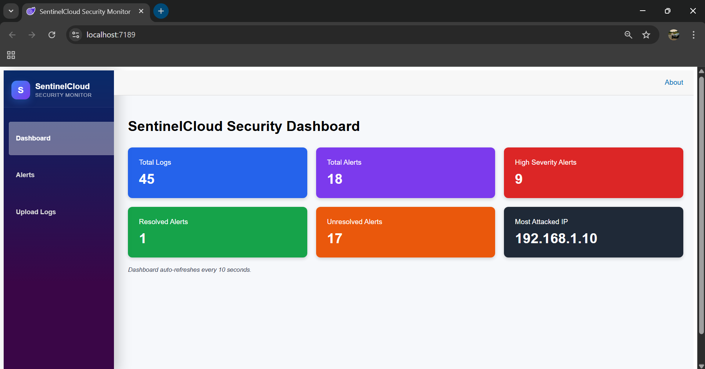
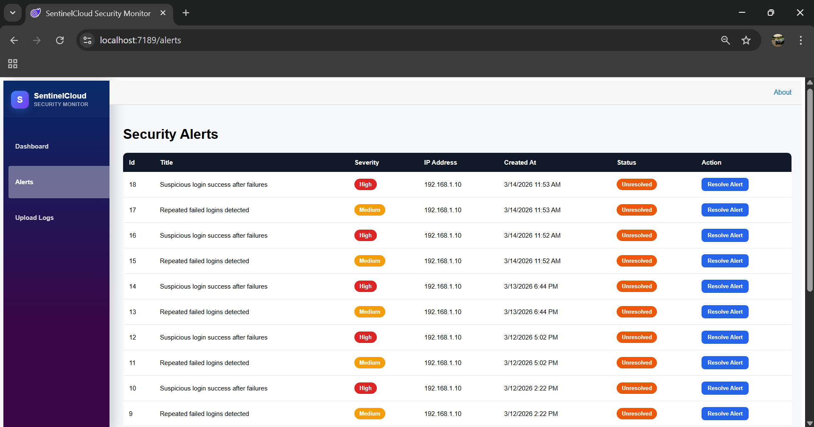
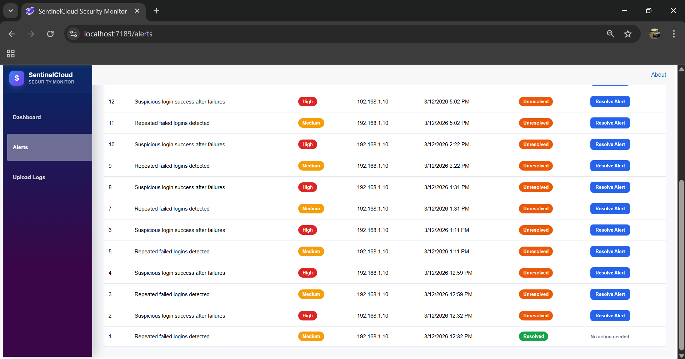
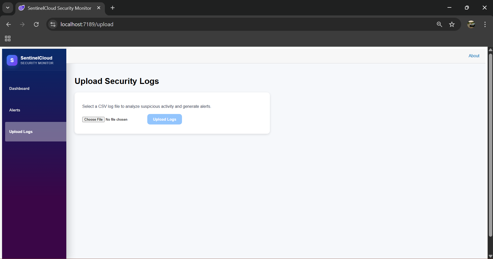
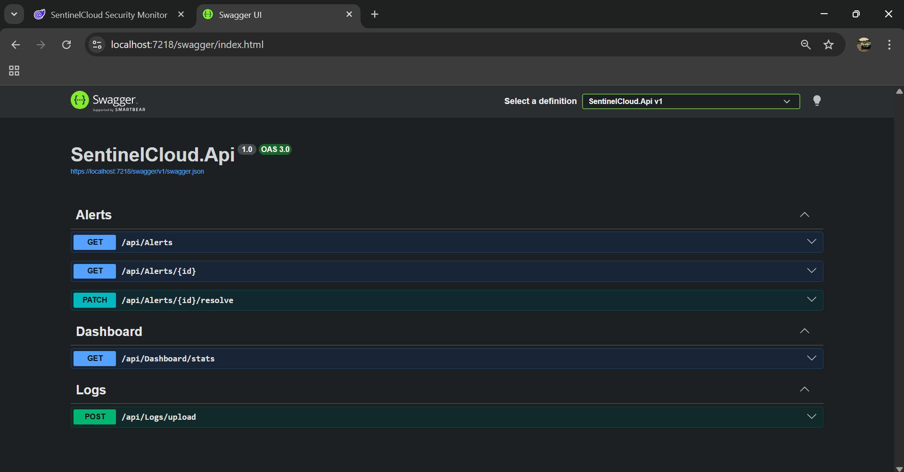
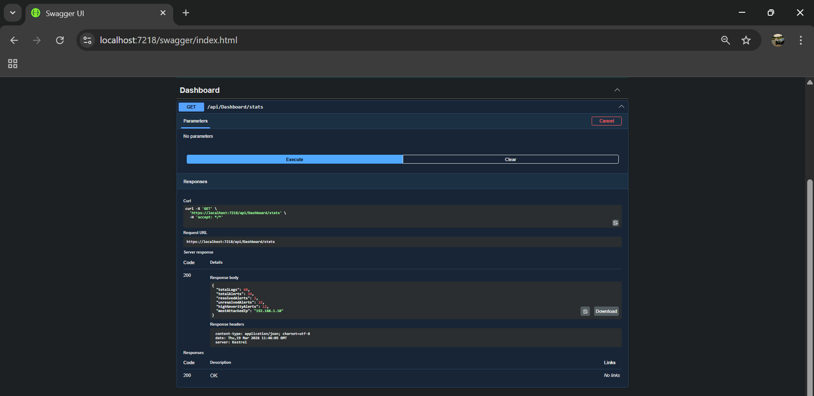

# SentinelCloud Security Monitor


SentinelCloud is a full-stack **security monitoring platform** that ingests authentication logs, detects suspicious activity, and visualizes alerts through a real-time monitoring dashboard.

The project simulates core capabilities found in modern **SIEM (Security Information and Event Management)** systems used by security operations teams.

It demonstrates practical skills in:

- Backend API development
- Threat detection logic
- Clean architecture design
- Interactive dashboards
- Security-focused system design

---

# Project Overview

Modern systems generate thousands of authentication events every day. Without automated monitoring, suspicious patterns such as brute-force attacks or repeated login failures can go unnoticed.

SentinelCloud addresses this problem by providing a simplified monitoring system that:

• Processes authentication logs  
• Detects suspicious activity  
• Generates security alerts  
• Provides real-time monitoring dashboards  
• Allows alerts to be investigated and resolved

---

# System Architecture

<p align="center">
  
</p>

The system follows a **Clean Architecture** approach separating presentation, API logic, domain logic, and infrastructure.

```
User
  |
  v
Blazor Dashboard (SentinelCloud.Web)
  |
  v
ASP.NET Core API (SentinelCloud.Api)
  |
  v
Threat Detection Logic (SentinelCloud.Core)
  |
  v
Data Persistence (SentinelCloud.Infrastructure)
```

This architecture ensures the system is **modular, scalable, and maintainable**.

---

# Dashboard Preview

## Security Monitoring Dashboard



The dashboard provides an overview of system activity including:

- Total logs processed
- Total alerts detected
- High severity alerts
- Resolved vs unresolved alerts
- Most targeted IP address

The dashboard automatically refreshes to provide near real-time monitoring.

---

## Alerts Monitoring



Security alerts include:

- Alert severity
- Source IP address
- Detection timestamp
- Alert resolution status

---

## Alert Resolution



Security analysts can investigate alerts and mark them as **resolved** once the issue has been reviewed.

---

## Log Upload Interface



Administrators can upload authentication logs which are automatically analyzed by the system.

---

# Backend API

The backend is implemented using **ASP.NET Core Web API**.

It processes authentication logs, generates alerts, and provides data to the monitoring dashboard.

---

## API Documentation (Swagger)



Swagger UI provides interactive API documentation allowing developers to explore and test endpoints directly.

Example endpoints include:

| Endpoint | Description |
|--------|--------|
| `/api/logs/upload` | Upload authentication logs |
| `/api/alerts` | Retrieve alerts |
| `/api/alerts/{id}` | Retrieve a specific alert |
| `/api/alerts/{id}/resolve` | Resolve an alert |
| `/api/dashboard/stats` | Retrieve dashboard statistics |

---

## Example API Request



The example above shows the **Dashboard Statistics endpoint** being executed in Swagger.

The API returns structured JSON containing system metrics such as total logs, alerts, and targeted IP addresses.

---

# Frontend

The frontend is built using **Blazor**.

It provides an interactive dashboard that allows administrators to:

- Monitor system activity
- View security alerts
- Upload authentication logs
- Resolve alerts after investigation

The UI communicates with the backend API to retrieve data and display security insights in real time.

---

# Technology Stack

| Technology | Purpose |
|--------|--------|
| ASP.NET Core | Backend API |
| Blazor | Interactive Web Dashboard |
| C# | Application Logic |
| Entity Framework Core | Data Access |
| Swagger | API Documentation |
| Git & GitHub | Version Control |
| Visual Studio | Development Environment |

---

## 🚀 Getting Started (Run the Project Locally)

Follow these step-by-step instructions to run the SentinelCloud system on your computer.

---

### 🧾 Prerequisites

Before starting, ensure you have the following installed:

- **Visual Studio 2022 or later**  
  https://visualstudio.microsoft.com/

- **.NET 6 SDK or later**  
  https://dotnet.microsoft.com/download

- **SQL Server (LocalDB or full version)**  
  (Usually installed automatically with Visual Studio)

---

### 📥 1. Clone the Repository

Open a terminal (or Git Bash) and run:

```bash
git clone https://github.com/alwandeally/SentinelCloud-Security-Monitor.git
```

### 2.Navigate into the project folder:

```
cd SentinelCloud-Security-Monitor
```


### 🧱 2. Open the Project in Visual Studio

1. Open Visual Studio
2. Click "Open a project or solution"
3. Select:

```
SentinelCloud.sln
```

## 📦 3. Restore Required Packages

Visual Studio usually restores packages automatically.

If not:

Go to:
Tools → NuGet Package Manager → Manage NuGet Packages
Click Restore

Or run:

```
dotnet restore
```
## 🧠 4. Run the Backend (API)

This starts the core system logic and API endpoints.

Steps:
1. In Solution Explorer, locate:
```
SentinelCloud.Api
```

2. Right-click it → select:
 ```  
Set as Startup Project
```
3. Press:
```
F5
```

## 5.🖥️ Access the Dashboard

1.Your browser will open:

```
https://localhost:xxxx/
```
You will now see:

1. Security dashboard
2. Alerts page
3. Log upload interface


## 🔁 6. Full System Workflow

1. Upload authentication logs through the web interface
2. The backend API processes the logs
3. Suspicious activity is detected
4. Alerts are generated and displayed
5. Dashboard updates automatically


## ⚠️ 7.Troubleshooting

1. If the API does not start → ensure .Api is set as startup project
2. If the UI shows no data → ensure the API is running
3. If ports are busy → restart Visual Studio

---

## ✅ You're Ready!

The SentinelCloud system should now be running locally 🚀

---


# Example Workflow

1. Upload authentication logs through the **Upload Logs page**
2. Logs are processed by the backend API
3. Suspicious patterns are detected automatically
4. Alerts appear in the **Alerts dashboard**
5. Analysts investigate and resolve alerts

---

# Future Improvements

Possible enhancements include:

• Real-time log streaming  
• Cloud deployment (AWS or Azure)  
• Machine learning anomaly detection  
• Role-based authentication  
• Integration with external SIEM platforms

---

# License

This project is licensed under the **MIT License**.
